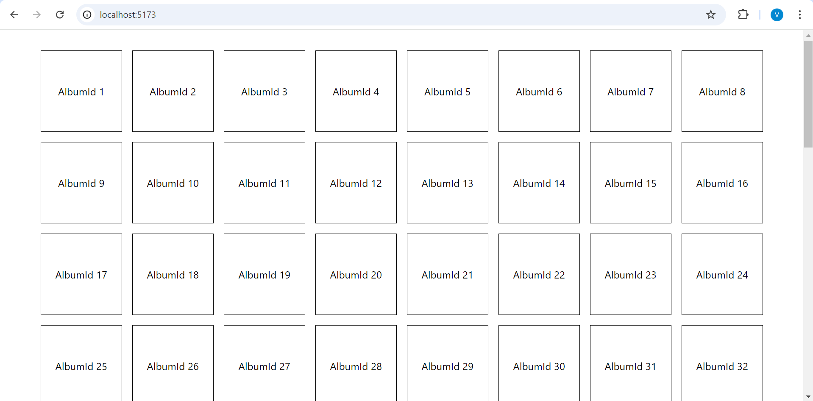
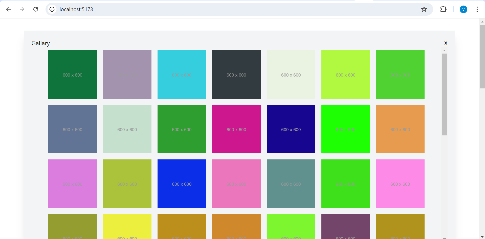

# Image Gallery

Use jsonplaceholder image api https://jsonplaceholder.typicode.com/photos

API retuns 100 albums and each album have 50 photos, 5000 image url in api response.

# Task
1. Render clickable album cards(100).
2. On clicking an album you should render all the photos linked with the album.

